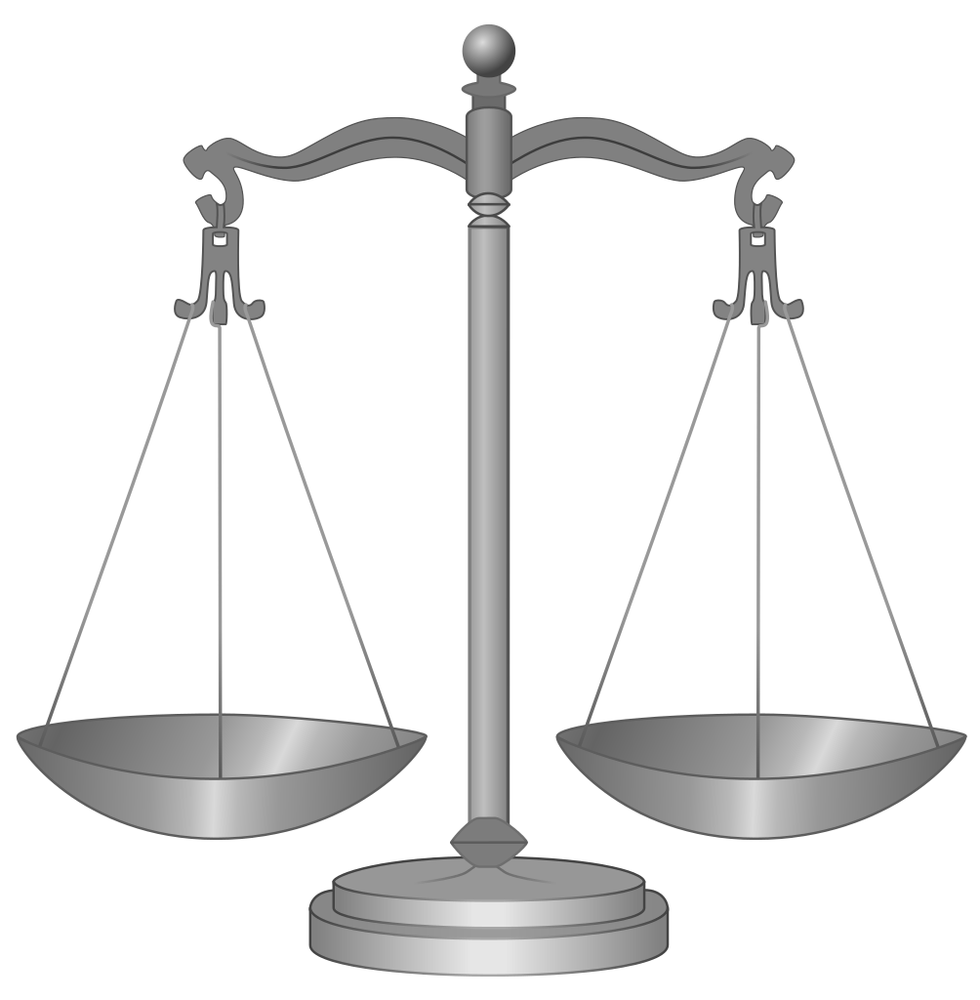

In this puzzle we have $9$ identical balls, except by one, which weighs less. Our task is to identify the light ball, and for this we have a scale in which we can compare the weight of $2$ sets of balls.

How do we ensure the least number of scale comparisons? What is this number?

Solution

We can ensure only $2$ comparisons as follows. First, compare the weight of two set of $3$ balls: if the scale is balanced, then the light ball is among the $3$ balls not in the scale; if the scale is unbalanced, then the light ball is in the lighter weighed set of balls. Note that in any case the problem is reduced to solve the same problem but with $3$ balls, which can be solved with just $1$ comparison as before: Compare $2$ balls: if the scale is balanced the light ball is the other one, otherwise the light ball is the lighter in the comparison.

