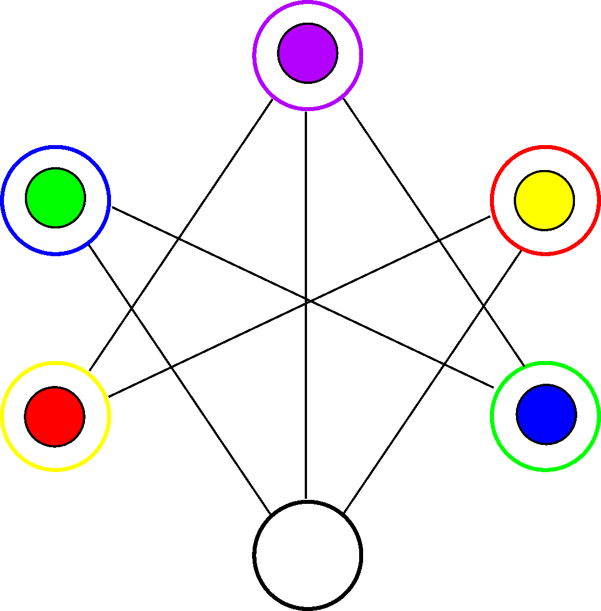
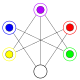

In this puzzle we are presented with a maze and $5$ balls of different colors (red, green, violet, yellow and blue), which are placed in $5$ different holes. In total there are $6$ holes also colored in different colors (yellow, blue, violet, red, green and black).

Two holes can be connected, meaning that we can move ball between the respective holes. Specifically, we are allowed to move a ball into an empty hole if this is connected to the hole containing the ball.

In the following animation we can see a movement of the green ball to the black hole, and then a movement of the blue ball to its blue hole.

Just as a convention we will name a movement after the hole it leaves empty. So the previous animation shows the movements blue and green.

To solve this puzzle we must move the balls so we end up with every ball on its respective hole, that is, the following configuration:

What are the movements to reach this state?

Solution

... More explanation soon ...

