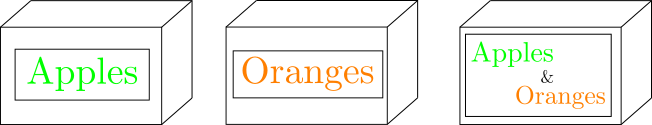

---
title: "Three Boxes"
summary: "A boxes' puzzle"
authors:
- admin
tags:
- Puzzle
date: 2019-09-21T02:00:00
featured: false
draft: false

# Featured image
# To use, add an image named `featured.jpg/png` to your page's folder.
# Placement options: 1 = Full column width, 2 = Out-set, 3 = Screen-width
# Focal point options: Smart, Center, TopLeft, Top, TopRight, Left, Right, BottomLeft, Bottom, BottomRight
image:
  placement: 1
  focal_point: ""
  preview_only: false

# Projects (optional).
#   Associate this post with one or more of your projects.
#   Simply enter your project's folder or file name without extension.
#   E.g. `projects = ["internal-project"]` references `content/project/deep-learning/index.md`.
#   Otherwise, set `projects = []`.
projects: []
math : true
---

In this puzzle we have $3$ boxes containing only apples, only oranges, and apples and oranges each.

The boxes are closed and labeled: apples, oranges, and apples and oranges, but we know for a fact that these labels are incorrect.

Our task is to put the labels in the right boxes. We can ask for showing us one fruit from one box of our choose, but without showing us the entire content of this box.

What box should we choose? Why?

Solution

We choose the box labeled apples and oranges. If we see and apple (other case is analogous), then the right label for this box is apples (as the label apples and oranges is wrong and it couldn't be oranges). Finally, as the oranges label is incorrect we put it on the other box and put apples and oranges on this box.

